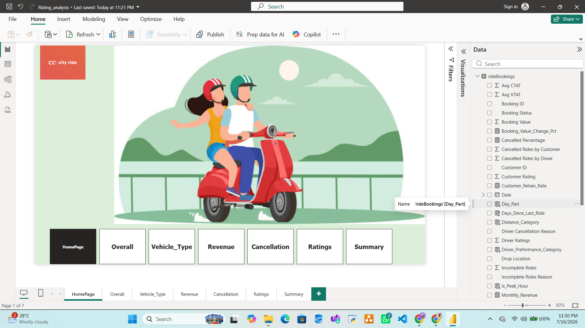
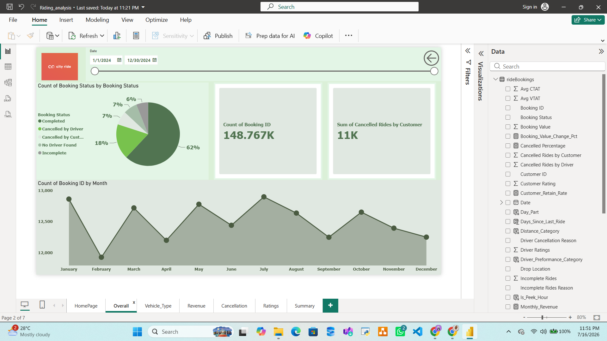
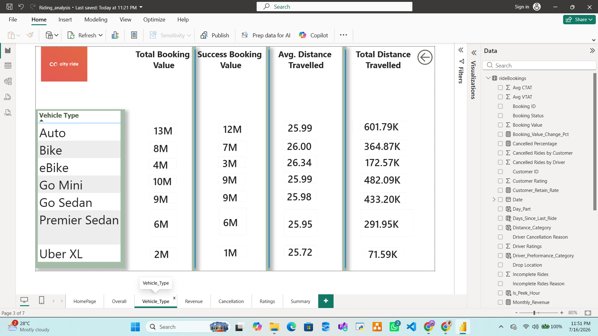
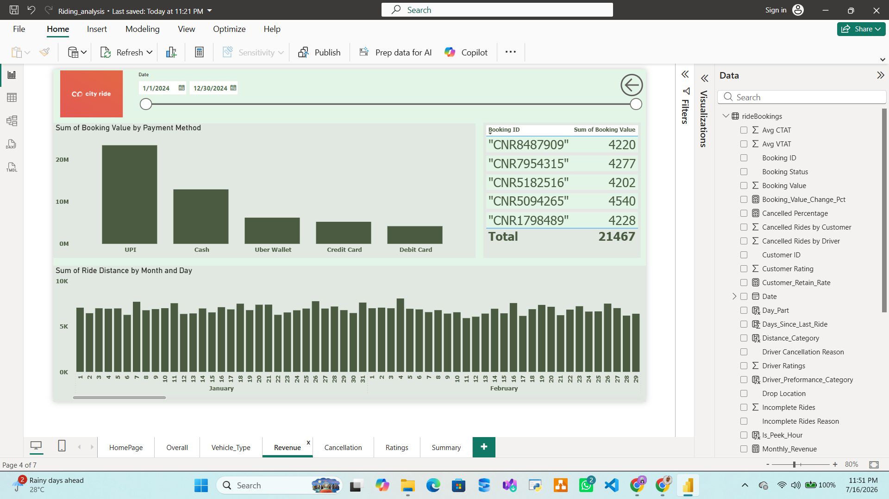
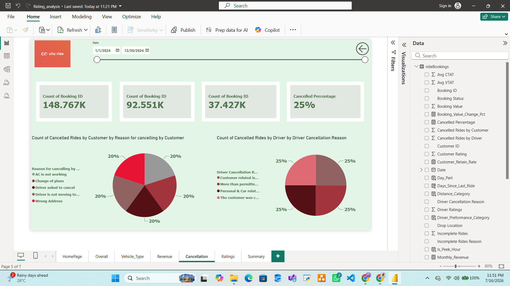
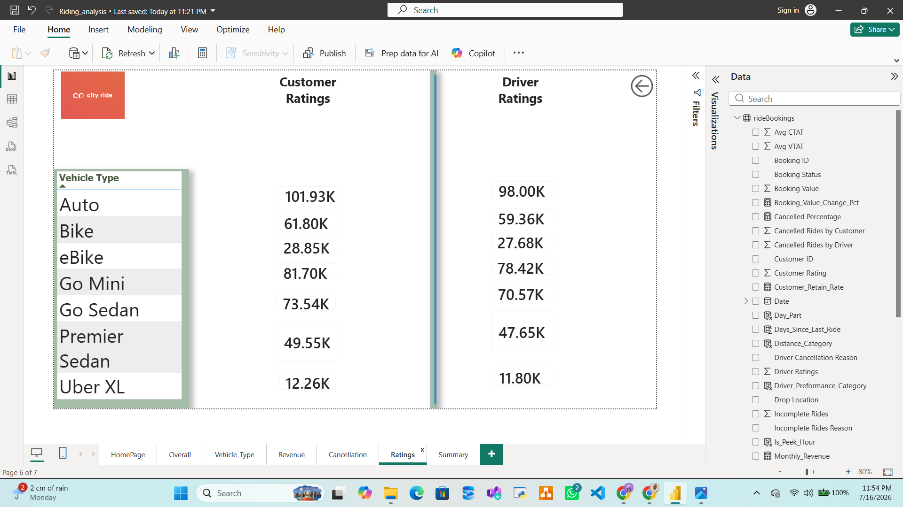
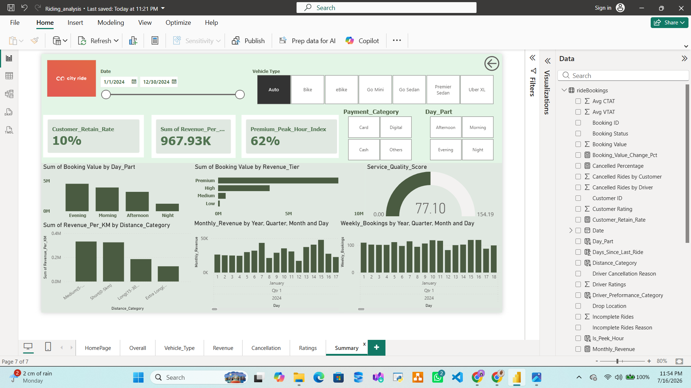

# 🚗 City Ride: Operational & Revenue Analytics Dashboard

An interactive, 7-page Power BI business intelligence solution designed to analyze and optimize ride-hailing operations. This project transforms over **148,000 raw transaction logs** into high-value strategic signals, focusing on booking performance, vehicle segment utilization, cancellation root causes, and revenue leakage.

Efficient operations play a critical role in the mobility and ride-hailing industry. Inefficiencies like driver cancellations, slow turnaround times, and mismatched vehicle supply can increase costs, delay rides, and reduce customer satisfaction. The goal of this project was to transform raw ride transaction data into meaningful insights that operations managers can use to monitor daily performance, optimize fleet distribution, and recover lost revenue.

## Tools & Technologies:
1. **Microsoft Power BI**
2. **Power Query** (Data Cleaning & Transformation)
3. **DAX (Data Analysis Expressions):** DAX Measures used to make the dashboard dynamic. I created calculated measures using DAX, including: `Customer Retention Rate`, `Premium Peak Hour Index`, `Service Quality Score`, `Cancelled Percentage`, `Average Customer/Vehicle Transition Time (CTAT/VTAT)`, and `Success Booking Value`.
4. **UI/UX Designing & Navigation Architecture:** Designed a user-centric, button-based landing interface with custom page-back interactions, uniform padding, and a tailored color palette to build a clean, distraction-free corporate dashboard that feels like a native web application.
5. **Interactive Visualizations & Slicers:** Advanced filters were embedded across all pages to let users slice performance metrics dynamically by Date, Vehicle Type, Payment Category, and Day Part.

---

## 📸 Dashboard Previews

### 📊 Landing Page

### 🔍 Operational Deep-Dives

### 🎯 Executive Summary

---

## 💾 Dataset Information
The raw data utilized in this project simulates realistic ride-hailing operational logs over a one-year period (2024).
* **Data Source:** The complete dataset can be found in the `/data` folder of this repository as a `.csv` / `.xlsx` file.
* **Total Records:** 148,767 unique booking rows.
* **Key Attributes Tracked:** `Booking ID`, `Booking Status`, `Booking Value`, `Vehicle Type`, `Payment Method`, `Ride Distance`, `Cancellation Reason` (Driver/Customer), `Customer Rating`, `Driver Rating`, `Day Part`, and `Is_Peak_Hour`.

---

## The dashboard includes:
1. **HomePage (Landing Page):** A clean navigation center linking all 6 analytical modules.
2. **Overall Performance:** Tracks the absolute operational baseline, including total booking volumes, completion rates, and historical monthly trends.
3. **Vehicle Type Analysis:** Drills down into individual fleet performance across 7 distinct vehicle segments comparing total values, success values, and distances.
4. **Revenue Optimization:** Maps cash flow distributions, monitors payment vehicle preferences, and tracks daily distance yields.
5. **Cancellation Diagnostics:** Directly targets systemic revenue leakage by categorizing and diagnosing the specific friction points causing customer and driver drop-offs.
6. **Ratings & Feedback Grid:** Cross-references customer and driver satisfaction ratings across vehicle tiers to isolate service gaps.
7. **Strategic Executive Summary:** A high-level command center displaying key operational efficiency indicators, retention rates, and fleet utilization health.

---

## 🔍 Key Insights
1. **The Volume Baseline:** The platform processed **148.77K total bookings** within the target window, establishing a baseline **62% ride completion rate** and a **25% overall cancellation rate**.
2. **Revenue Conversion Champions:** While **Auto ($13M)** and **Go Mini ($10M)** dominate gross booking volume, **Go Sedan** exhibits maximum conversion efficiency, transforming a full **$9M in bookings into $9M in successful revenue**.
3. **Distance Uniformity:** Average trip distances remain remarkably stable across the entire fleet, consistently hovering between **25.72 km and 26.34 km**, irrespective of the vehicle type chosen.
4. **Payment Demographics:** Digital transactions heavily control platform volume. **UPI** represents the preferred payment method, processing **over $20M**, followed next by Cash transactions (~$10M).
5. **Customer Friction Points:** Customer-side cancellations are uniformly distributed (~20% each) across clear quality bottlenecks: *"AC not working," "driver asked to cancel," "driver not moving,"* and *"wrong address."*
6. **Driver Rejection Behavior:** Driver-side cancellations also mirror an even split (~25% each) across systemic causes (e.g., customer behavior, exceeding passenger limits, and vehicle issues).
7. **Executive Health Metrics:** The platform maintains a **10% Customer Retention Rate** paired with a **62% Premium Peak Hour Index**. The overall fleet attained a **Service Quality Score of 77.10 out of 154.19**, indicating a massive window for operational optimization.

---

## This project helped me gain practical experience with:
* **User-Centric UI/UX Dashboard Design:** Understanding dashboard layout frameworks, custom grids, and how cohesive color application drives fast, scannable data comprehension.
* **Navigation & UX Mechanics in BI:** Implementing navigation panels, toggles, slicers, and native back-buttons to convert a rigid report into an intuitive app environment.
* **Data Modeling & Transformation:** Architecting clean relational tables within Power BI and performing pre-processing techniques inside Power Query.
* **Writing DAX Measures for Business KPIs:** Developing structural expressions to handle dynamic conditions like quality margins and fleet retention metrics.
* **Business-First Mindset:** Learning that technical data preparation and graphic layouts are only valuable if they point directly to an operational fix (e.g., catching cancellation leaks to recover revenue).

If you have any suggestions or ideas for improving this dashboard, I'd be happy to hear them. Every piece of feedback helps me grow!!
